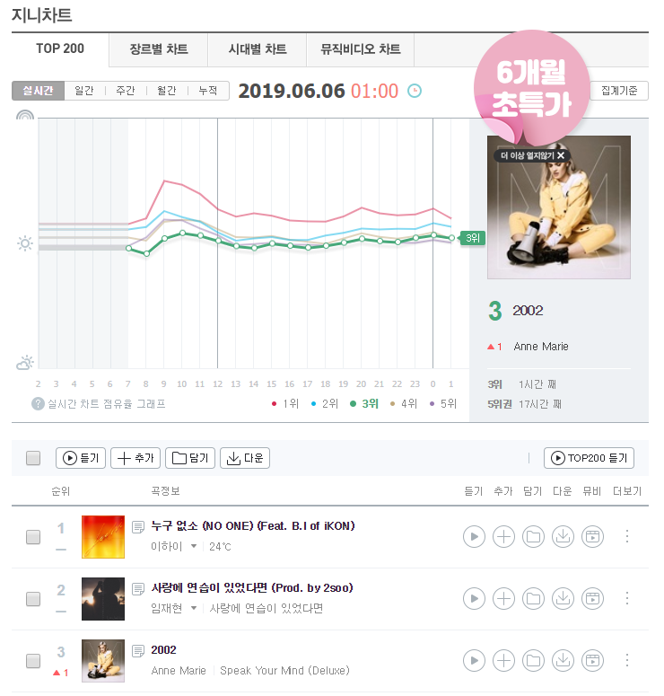
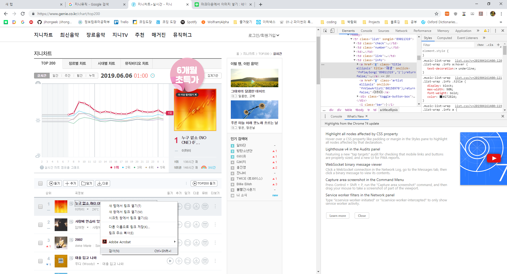
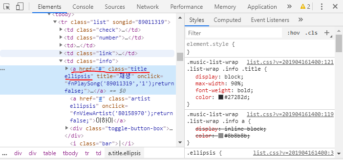

# 크롤링 이란?
**크롤링(crawling)** 은 웹에서 정보를 수집하는것을 말합니다.  
crawl이란 영어단어는 원래 "기어가다"라는 뜻이 있는데,     
크롤러가 웹사이트를 기어다니면서 정보를 수집한다고 이해하시면 될 것 같습니다.
##  사용 할 것들
- **Python** 쉽고 재밌는 언어로써 좋은 라이브러리를 가지고 있습니다.  
  - **requests** ([문서](https://2.python-requests.org/en/master/api/)) 파이썬 라이브러리로, 여기서는 웹사이트를 html로 저장하는 역할로 사용 됩니다.  
  - **BeautifulSoup** ([문서](https://beautiful-soup-4.readthedocs.io/en/latest/)) 역시 파이썬 라이브러리로 html를 파싱하게 해줍니다.  
- **웹에 대한 약간의 이해** ([생활코딩 WEBn](https://opentutorials.org/course/3083)) 웹, 주로 html과, css를 안다면 좀 더 똑똑한 크롤러를 만들 수 있습니다.  
## 시작
```
import requests
from bs4 import BeautifulSoup
```
사용할 라이브러리를 불러옵니다.
```
def get_html(url):
   _html = ""
   resp = requests.get(url)
   if resp.status_code == 200:
       _html = resp.text
   return _html
```
해당 url의 html을 가져오는 함수를 선언합니다.  
```
html = get_html("https://genie.co.kr/chart/top200")

```

웹 사이트의 html을 가져와 변수 html에 저장합니다.(필자는 지니 뮤직차트로 진행 했습니다.)  
```
soup = BeautifulSoup(html, 'html.parser')
```
soup 이라는 BeautifulSoup 인스턴스를 선언 합니다.
## 태그 ,속성으로 원하는 정보 찾기  
먼저 웹사이트로 들어간 다음  

  
  
    
    
자기가 원하는 정보(필자는 노래 제목으로 했습니다.)에 우클릭을 한다음에 검사를 클릭하면,  

  
  
    
    
이런식으로 옆에 창에 html 소스가 보입니다.  

  
  
  
그럼 자기자신이 선택한 부분이 어떤 html 태그인지와 클래스 값은 무엇인지 알 수 있습니다.  

```
soup.find_all("a",{"class":"title ellipsis"})

```
이 코드는 a 태그, 클래스가 title ellipsis인 html 코드를 찾아서 리스트로 반환합니다.  
```
[<a class="title ellipsis" href="#" onclick="fnPlaySong('89011319','1');return false;" title="재생">누구 없소 (NO ONE) (Feat. B.I of iKON)</a>

                                                ...
                                              이하생략
                                                ...

, <a class="title ellipsis" href="#" onclick="fnPlaySong('88951935','1');return false;" title="재생">안녕하세요</a>]                                                

```
이렇게 말입니다.(물론 출력을 위해서는 print를 써줘야 겠죠?)  
그럼 기초적인 파이썬(반복문,조건문등)을 통해서 정보를 자신의 입맛에 맞게 가공하시면 됩니다.  
<<<<<<< HEAD
사실 '정규표현식'을 이용하면 더 효율적으로 크롤링을 할 수있지만 그건 나중에 다루겠습니다.
**지금까지의 코드는 [parser1.py](https://github.com/jihongeek/PressF5/blob/master/Python_crawler/parser1.py) 입니다.** 
=======
사실 **정규표현식** 을 이용하면 더 효율적으로 크롤링을 할 수있지만 그건 나중에 다루겠습니다. 
>>>>>>> 68f65da1db1c8d4cac42017a7164ff90429183b5
